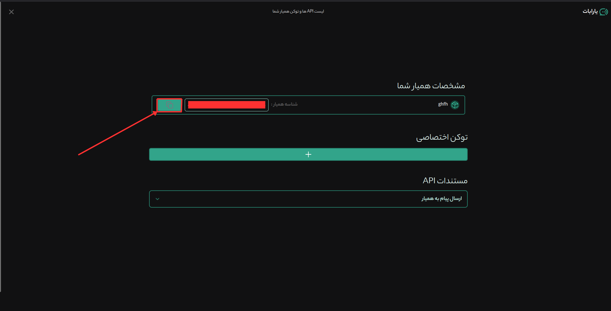
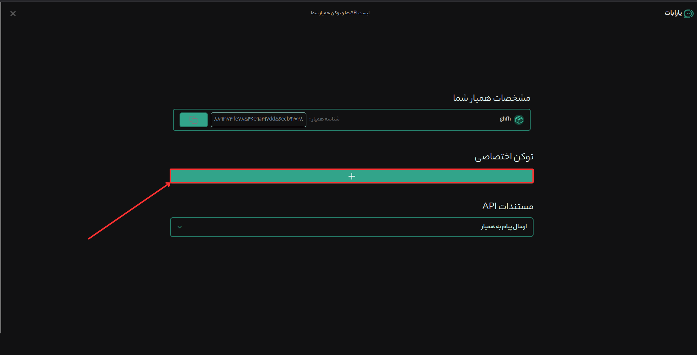
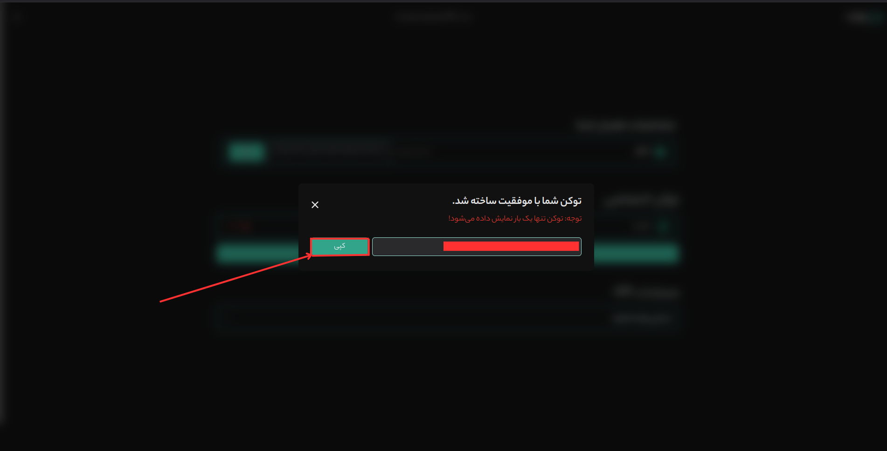

# 🌟 YaraBot

YaraBot is a state-of-the-art online chat platform powered by artificial intelligence. It allows users to create personalized chatbots effortlessly—no programming skills required. With its intuitive interface and robust tools, YaraBot serves as your all-in-one solution for building custom, functional chatbots tailored to various needs.

---

## 🚀 Features

- **📱 Responsive Design**: Optimized for seamless performance on all devices, from desktops to smartphones.
- **🎨 Dynamic User Interface**: Crafted with the latest technologies for a smooth and engaging user experience.
- **🛠️ No-Code Chatbot Creation**: Ideal for users of any skill level—no coding expertise needed!

---

## 🔧 Installation

Follow these steps to set up YaraBot on your local system:

1. **Clone the repository**:

   ```bash
   git clone https://github.com/yarabot-ir/yara-agent.git
   ```

2. **Navigate to the project directory**:

   ```bash
   cd YaraBot
   ```

3. **Set up environment variables**:  
   Locate the `.env` file in the root directory and add the following:

   ```env
   VITE_BASE_AGENT_ID=<AGENT_ID>
   VITE_BASE_AGENT_TOKEN=<AGENT_TOKEN>
   ```

4. **Run Docker Compose**:

   ```bash
   docker compose up --build -d
   ```

5. **Access YaraBot**:  
   Open your browser and visit:  
   [http://localhost:7200](http://localhost:7200)

---

## 🔧 How to Create an Agent

1. Visit [YaraBot](https://yarabot.ir/).
2. Click on "Create Agent."
3. Follow the instructions to set up your agent.

---

## 🔧 How to Retrieve the Agent ID

1. Visit [YaraBot](https://yarabot.ir/).
2. Navigate to "Manage Agent."
3. Your Agent ID will be displayed there.



---

## 🔧 How to Retrieve the Agent Token

1. Visit [YaraBot](https://yarabot.ir/).
2. Navigate to "Manage Agent."
3. Your Agent Token will be available under the token section.





---

## 📜 License

This project and all associated rights are owned by **Yarabot** and the **intelligent agents of Danaye Darnika**.

---

We can’t wait to see the amazing chatbots you’ll create with YaraBot. Have fun and enjoy! 🎉
